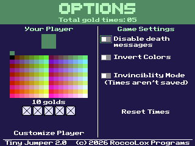

# Tiny Jumper 2

Sequel to the classic [Tiny Jumper](https://github.com/RoccoLoxPrograms/Tiny-Jumper)!

Tiny Jumper 2 is a speed-running platformer, where you must navigate through obstacles to complete levels as quickly as possible. This sequel has new levels, new obstacles, and new secrets...

## Screenshots
 

## Controls (*for the menu*)

| Key(s)                                               | Action                 |
|------------------------------------------------------|------------------------|
| <kbd>↑</kbd> <kbd>↓</kbd> <kbd>←</kbd> <kbd>→</kbd>  | Move the cursor        |
| <kbd>clear</kbd>                                     | Quit the game          |
| <kbd>2nd</kbd> or <kbd>enter</kbd>                   | Select a level         |
| <kbd>mode</kbd>                                      | Go to the options menu |

## Controls (*when in a level*)

| Key(s)                    | Action                     |
|---------------------------|----------------------------|
| <kbd>←</kbd> <kbd>→</kbd> | Move the player left/right |
| <kbd>2nd</kbd>            | Jump                       |
| <kbd>clear</kbd>          | Quit to the menu           |

## Credits

Special thanks to [TIny_Hacker](https://github.com/TIny-Hacker) for the sprites and palette colors.

©️ 2022 - 2026 RoccoLox Programs

License available [here](https://github.com/RoccoLoxPrograms/Tiny-Jumper-2/blob/main/LICENSE)
